# tiCrypt File Transfer Guide for Windows

*SFTP to VM · SSHFS Remote File System · lftp (Command Line) · SFTP Inbox / Vault*

BU Research Computing Services | help@scc.bu.edu

## Overview

tiCrypt provides four ways to move files between your local machine and your Virtual Machine (VM). Each serves a different purpose — pick the one that matches your task.

**Method 1 — SFTP to VM:** Transfer files directly from your local machine into the VM using an SFTP client (e.g., WinSCP). Best for one-time or ad hoc uploads.

**Method 2 — SSHFS Remote File System:** Mount your VM as a network drive on your local Windows machine. Best for ongoing work where you want drag-and-drop convenience.

**Method 3 — lftp (Command Line):** Script or run bulk/resumable transfers from a terminal. Best if you're comfortable on the command line or need to automate transfers.

**Method 4 — SFTP Inbox / Vault:** Allow external collaborators (outside tiCrypt) to send large files directly into your encrypted Vault. Best for receiving data from partners.

> **⚠ Note:** *SFTP in tiCrypt is write-only by design — you can upload files into the VM but cannot read or download existing files via SFTP. This is a security feature.*
>
> **⚠ Note:** *Your VM must be connected (green dot) before starting any transfer. Resetting an RDP connection will interrupt active SFTP transfers.*

## Method 1: SFTP to VM

This method transfers files directly from your local machine into the VM using an SFTP client. The connection goes through the encrypted tiCrypt tunnel, so no VPN beyond the BU network is needed.

### Prerequisites

- tiCrypt Connect application installed and running

- Your VM is connected (green dot in the VMs list)

- WinSCP installed on your local Windows machine (winscp.net)

- SFTP enabled on your VM

### Step-by-Step

#### Step 1: Get SFTP Credentials from tiCrypt

1.  Open tiCrypt Connect and log in.

2.  Click the Virtual Machines icon in the top left taskbar.

3.  In the VMs list on the left, click your VM (e.g., aa-scc-testvm1).

4.  Click SFTP to VM in the center-right panel.

5.  In the pop-up window, each credential field (host, port, username, password) has a copy button beside it — use these to copy values instead of retyping them.

> **⚠ Note:** *These credentials are ephemeral — they expire and regenerate each session. Always copy fresh credentials right before connecting, not in advance.*

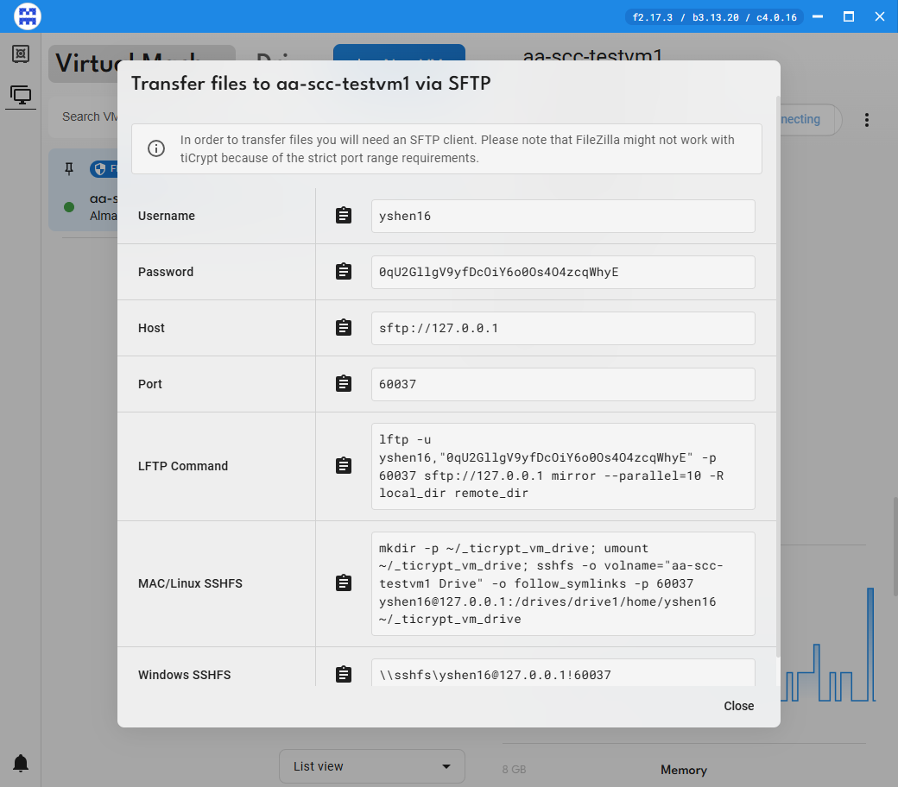

*tiCrypt's SFTP to VM credential pop-up*

Leave this window open for the next steps. If you close it, reopen it anytime from the VM's SFTP to VM button.

#### Step 2: Connect with WinSCP

1.  Open WinSCP on your local machine.

2.  In the Login dialog, set Protocol to SFTP.

3.  Paste the Host name, Port number, User name, and Password from the tiCrypt pop-up.

4.  Click Login.

5.  If prompted with a server fingerprint warning, click Accept (expected for the tiCrypt tunnel).

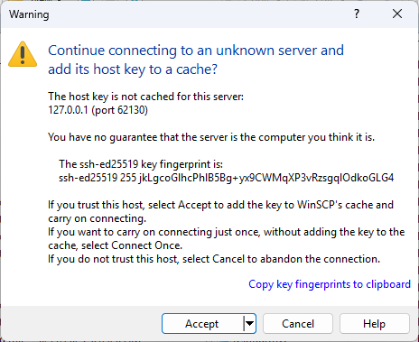

*WinSCP login dialog*

#### Step 3: Transfer Files

6.  In WinSCP, the left panel shows your local machine and the right panel shows your VM (your VM home directory by default).

7.  Navigate to the destination folder on your VM (right panel).

8.  Drag and drop files from the left panel (local) to the right panel (VM).

9.  Wait for the transfer queue to complete.

10. When finished, click Session > Disconnect in WinSCP.

### Troubleshooting

**Connection fails after pasting password:** Close the SFTP pop-up in tiCrypt, reopen it by clicking SFTP to VM again, and use the newly generated password.

**Transfer interrupted:** If your machine sleeps or the VPN disconnects, the transfer stops. Reconnect and resume. For large transfers, prevent sleep via Control Panel > Power Options > Set sleep to Never.

## Method 2: SSHFS Remote File System (Windows)

SSHFS mounts your VM as a virtual network drive on your local machine. Once mounted, you can drag and drop files between your local machine and VM directly in File Explorer — no SFTP client needed.

> **⚠ Note:** *A separate license may be required for non-personal or commercial use of WinFSP and SSHFS-Win.*

### Prerequisites

- tiCrypt Connect application installed and running

- Your VM is connected (green dot)

- SFTP enabled on your VM

- WinFSP and SSHFS-Win installed (one-time setup — see below)

### One-Time Setup: Install WinFSP and SSHFS-Win

#### Install WinFSP

1.  Download the WinFSP installer from github.com/winfsp/winfsp/releases (or search "WinFSP download").

2.  Run the installer and click through the prompts, then Install. Click Yes if prompted to allow changes.

3.  Click Finish when done.

#### Install SSHFS-Win

1.  On the same WinFSP releases page, look for the SSHFS-Win download in the additional downloads section (or search "SSHFS-Win download").

2.  Run the installer, click through the prompts, then Install. Click Yes if prompted to allow changes.

3.  Click Finish when done.

### Step-by-Step: Mount Your VM as a Drive

#### Step 1: Get SSHFS Credentials from tiCrypt

1.  Open tiCrypt Connect and log in.

2.  Click the Virtual Machines icon in the top left taskbar.

3.  Select your connected VM from the left panel.

4.  Click the SFTP to VM card. (Up to this point, these steps are identical to Method 1.)

5.  In the pop-up, click Copy next to the Windows SSHFS field to copy the mount command.

#### Step 2: Mount the Drive

1.  Open File Explorer and paste the SSHFS path into the address bar at the top (it looks like \\sshfs\username@127.0.0.1!port).

2.  Press Enter. A Windows Security prompt will appear asking you to unlock the file system.

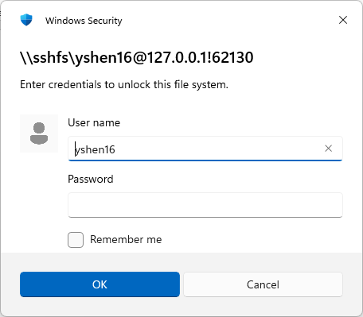

*Windows Security credential prompt for the SSHFS mount*

3.  The first time you connect, you may instead see a Command Prompt / PowerShell authenticity check with a SHA256 fingerprint — type yes and press Enter.

4.  Go back to the tiCrypt pop-up and click Copy next to the Password field to get a fresh password.

5.  Paste the password into the prompt immediately — these passwords expire quickly.

6.  If a system extension pop-up appears, click Allow. Restart if prompted.

> **💡 Tip:** *If the connection fails right after you paste the password, close the SFTP pop-up in tiCrypt, reopen it by clicking SFTP to VM, and use the newly generated password. Each tiCrypt session issues a new port and password, so an old, previously-copied one will not work.*

#### Step 3: Use the Mounted Drive

1.  Open File Explorer and go to This PC.

2.  Your VM will appear as a network drive. Double-click to open it.

3.  Drag and drop files between your local machine and the VM drive as you would any folder.

#### Step 4: Disconnect When Done

Best practice: always disconnect the mounted drive at the end of your session, before logging out of tiCrypt Connect.

1.  In File Explorer, go to This PC.

2.  Right-click the VM network drive.

3.  Select Disconnect.

> **💡 Tip:** *Previously mounted drives are automatically replaced when a new SSHFS command is run, but disconnecting manually avoids a stale, unusable drive icon lingering in File Explorer.*

## Method 3: lftp (Command-Line, via WSL)

lftp is a command-line SFTP/FTP client. It's a good fit if you're comfortable in a terminal, need to transfer many files at once, or want resumable/parallel transfers that WinSCP and SSHFS don't offer.

> **⚠ Note:** *lftp is not available natively on Windows. On Windows it must run inside Windows Subsystem for Linux (WSL). On Mac and Linux, lftp installs and runs natively — no WSL layer needed there.*

### Prerequisites

- tiCrypt Connect application installed and running

- Your VM is connected (green dot)

- SFTP enabled on your VM

- WSL installed on Windows, with lftp installed inside it

- Windows 11 version 22H2 or later (build 22621+), needed for the networking fix in Step 2 below

### One-Time Setup

#### Step 1: Install WSL and lftp

1.  Open PowerShell as Administrator and run:

```
wsl --install
```

2.  Restart your computer when prompted.

3.  Open your WSL Linux terminal (e.g., Ubuntu) from the Start menu.

4.  The first launch will ask you to create a Linux username and password. This is a separate account from your Windows login or BU account — write it down, since sudo will ask for it later.

5.  Install lftp:

```
sudo apt update && sudo apt install lftp

```

> **⚠ Note:** *The sudo password is the Linux password you just created in WSL — not your Windows password, BU password, or tiCrypt password. If you forget it, reset it from a Windows PowerShell (not WSL) window with: wsl -u root, then inside that root shell run passwd <yourusername>.*

#### Step 2: Enable Mirrored Networking (required)

tiCrypt's SFTP tunnel listens only on 127.0.0.1 on the Windows side. By default, WSL runs in its own network namespace with a different 127.0.0.1, so it cannot reach the tunnel at all — connections will hang and silently retry instead of failing outright. Mirrored networking makes WSL share Windows' loopback address, which fixes this.

6.  In Windows PowerShell (not WSL), run:

```
@"
[wsl2]
networkingMode=mirrored
"@ | Set-Content -Path "$env:USERPROFILE\.wslconfig" -Encoding ascii
```

7.  Verify the file was created correctly:

```
Get-Content "$env:USERPROFILE\.wslconfig"
```

8.  Restart WSL so the setting takes effect:

```
wsl --shutdown
```

9.  Wait about 10 seconds, then reopen your WSL terminal.

> **⚠ Note:** *Mirrored networking requires Windows 11 22H2 (build 22621) or later. Check your build via winver. If your build is older, this mode isn't available, and lftp inside WSL will not be able to reach tiCrypt's tunnel — use WinSCP or SSHFS instead.*

#### Step 3: Allow lftp to Skip Host-Key Prompts (required)

Each new tiCrypt SFTP session reuses 127.0.0.1 but presents a different host key on a different port. lftp's SFTP backend treats this as a conflicting/untrusted host and refuses to connect with a "Host key verification failed" error, rather than prompting you to accept it. Since every connection here is to tiCrypt's own trusted local tunnel, it's reasonable to have lftp auto-accept these each time.

10. In your WSL terminal, run:

```
echo "set sftp:auto-confirm yes" >> ~/.lftprc
```

This only needs to be done once — it applies to every future lftp session automatically.

### Step-by-Step: Transfer Files with lftp

#### Step 1: Get SFTP Credentials from tiCrypt

Same as Method 1 — open the SFTP to VM pop-up and copy the Port and Password (host is always 127.0.0.1).

#### Step 2: Connect

1.  Open your WSL terminal.

2.  Connect using the port and password from the tiCrypt pop-up, with the username and password separated only by a comma (no space):

```
lftp -u yshen16,PASTE_PASSWORD_HERE -p <port> sftp://127.0.0.1
```

3.  You'll land at an lftp yshen16@127.0.0.1:~> prompt. lftp connects lazily, so nothing happens until you run a command — try:

```
ls -la

```

> **💡 Tip:** *If a comma is followed by nothing (e.g., lftp -u yshen16, sftp://...) lftp attempts to connect with a blank password, which fails silently. Always put the password directly after the comma, with no space.*

#### Step 3: Transfer Files

Remote (VM) and local (WSL) commands are separate — local commands are prefixed with l, or you can run any shell command locally with a leading !

```
pwd # show current remote (VM) directory
cd <remote_dir> # change remote directory
ls # list remote files

lpwd # show current local (WSL) directory
lcd <local_dir> # change local directory
!ls -la # list local files (lls is not available in all lftp builds)
```

To upload a whole folder, point the local side at the source and give the remote side a destination name — you don't need to lcd first if you pass a full local path directly:

```
mirror -R /mnt/c/Users/<you>/Favorites Favorites
```

mirror -R copies local to remote (uploads). Plain mirror without -R copies remote to local (downloads, and is blocked — see the write-only note at the top of this guide). The destination argument is just a folder name/path on the VM; it does not recreate the full source path.

```
put <file> # upload a single file
mput * # upload multiple files (wildcard)
mirror -R --parallel=5 . Favorites # faster upload using 5 parallel connections
bye # disconnect

```

> **💡 Tip:** *mirror -R --parallel=N speeds up large, multi-file transfers noticeably over a single-threaded upload.*
>
> **⚠ Note:** *The password from tiCrypt is ephemeral — copy a fresh one immediately before each new connection.*

### Troubleshooting

**"lftp: command not found":** You're in a Windows PowerShell prompt, not WSL. The Windows prompt looks like PS C:\Users\yourname>; the WSL prompt looks like yourname@computername:~$. Type wsl to enter WSL first.

**sudo password rejected during install:** You're typing your Windows/BU/tiCrypt password. sudo wants the separate Linux password set on WSL's first launch. Reset it via wsl -u root then passwd <username> if forgotten.

**Connection hangs on ls with "Delaying before reconnect":** WSL cannot reach 127.0.0.1 on the Windows host. Complete the mirrored networking setup in Step 2 above, then reconnect with a fresh port/password.

**"Host key verification failed":** Add set sftp:auto-confirm yes to ~/.lftprc as described in Step 3 above, then reconnect.

**mirror complains about an unrecognized option like --parallel:** mirror and its flags must be typed at the lftp yshen16@...:~> prompt after connecting — they cannot be appended to the initial lftp command on the same line.

## Method 4: SFTP Inbox / Vault (for External Collaborators)

This method is for receiving large files from external collaborators who do not have tiCrypt access. You create an SFTP inbox in your Vault and share a link with the sender. Files arrive encrypted directly into your Vault.

> **⚠ Note:** *Before creating an SFTP inbox, your admin must configure an SFTP external server under Management > System Settings. Contact help@scc.bu.edu if this option is not available.*

### Part A: Create an SFTP Inbox in Your Vault

1.  In tiCrypt, navigate to the My Vault tab in the My Files section.

2.  Click Create inbox (top of the Vault panel).

3.  Fill in the inbox access point details:

- Expiration date — when the inbox becomes inaccessible (always set one)

- Maximum capacity — the total file size the sender may upload

- Uploader name — used to track who is uploading (English letters only, no special characters)

- Message — instructions shown to the uploader on the inbox page

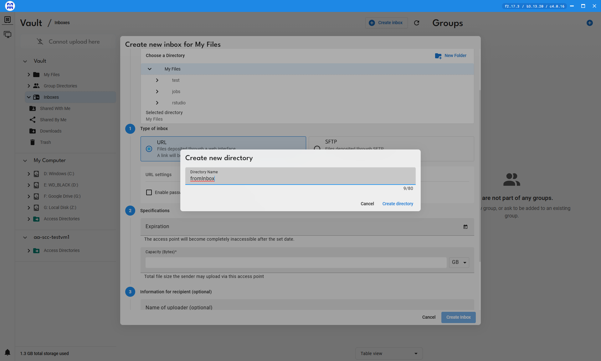

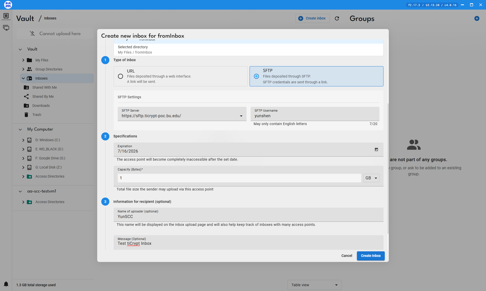

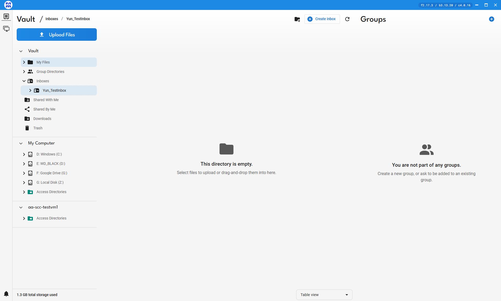

4.  Select the directory and click the Manage Inbox icon in the top right.

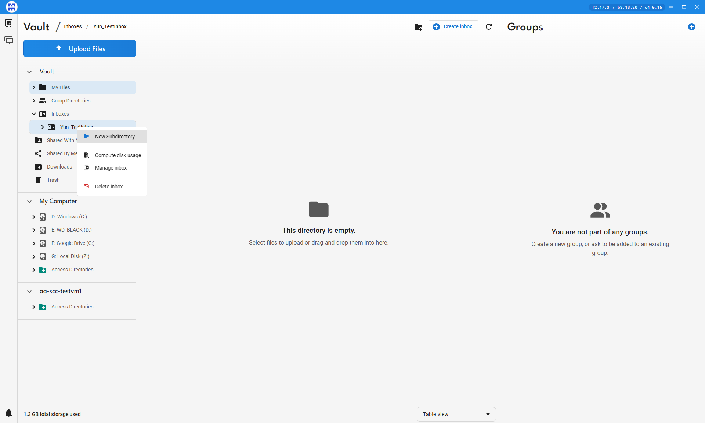

*Manage access points panel*

5.  Copy the URL from the Link to share field.

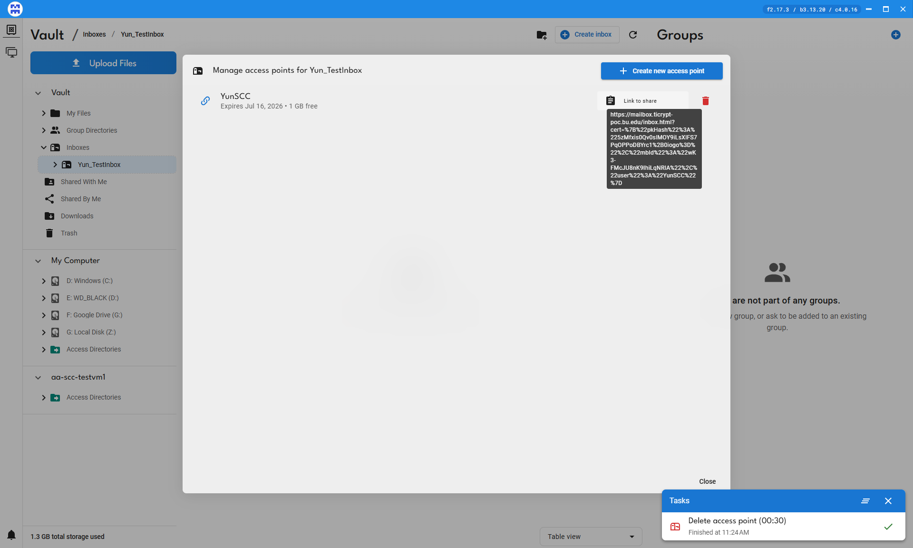

6.  Send the URL to your external collaborator via email or another channel.

> **⚠ Note:** *We recommend always setting an expiration date on inboxes.*

### Part B: External Collaborator Uploads Files

Share these instructions with your collaborator:

1.  Download WinSCP from winscp.net (Windows) or FileZilla from filezilla-project.org (Mac).

2.  Open a browser, paste the shared URL, and press Enter.

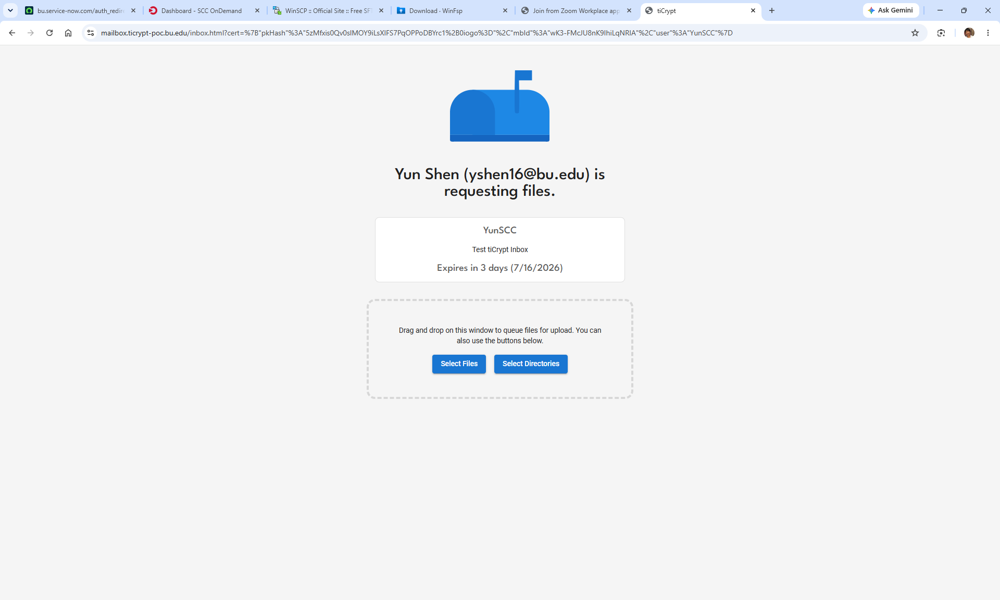

*Inbox upload page in the browser*

3.  Use Select files or Select directories to open a file browser and choose what to send.

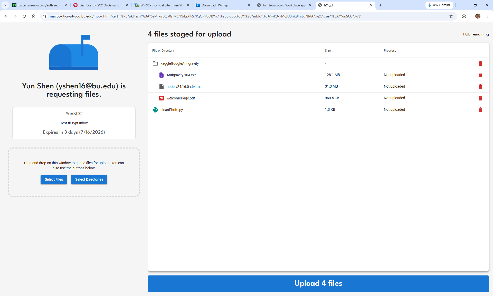

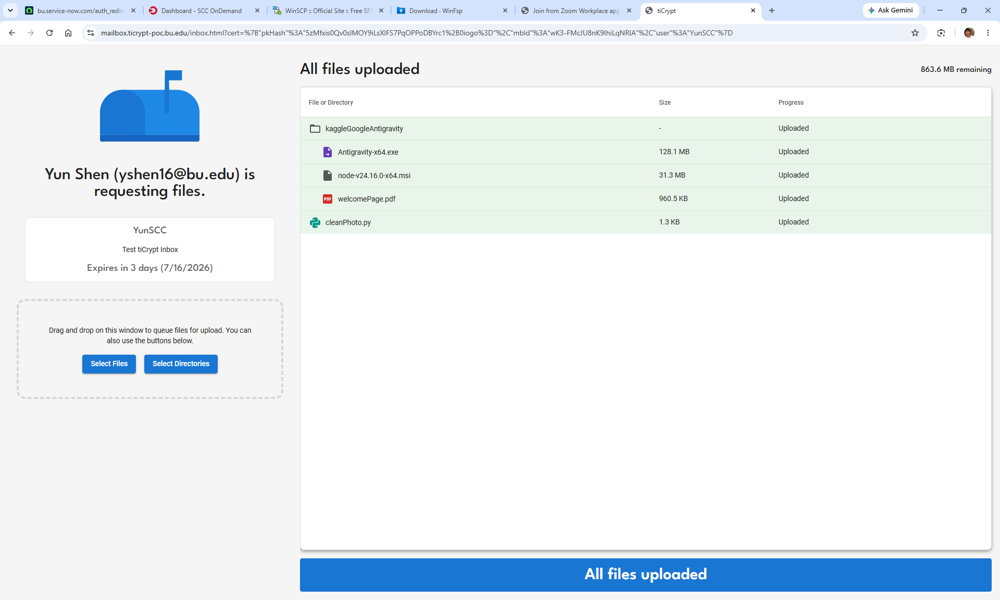

4.  Wait for the All files uploaded confirmation — files are now in your Vault.

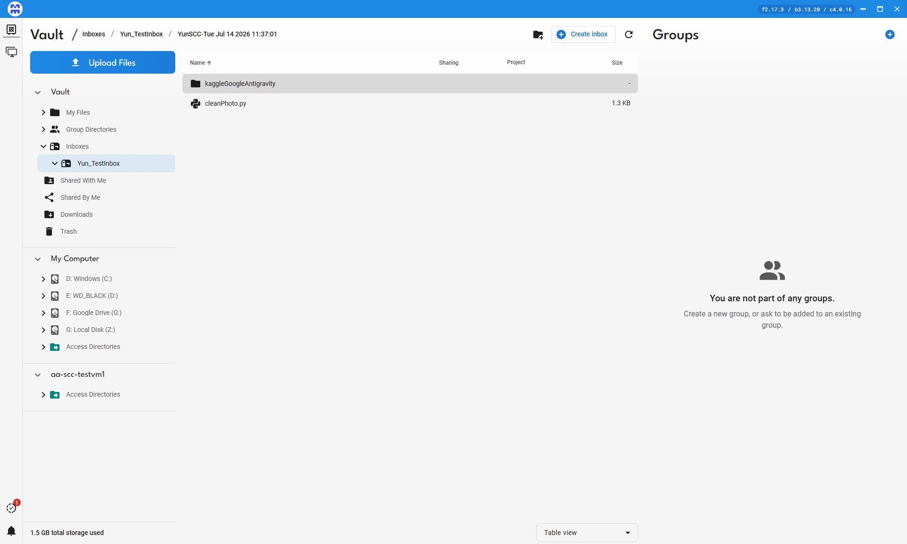

> **💡 Tip:** *There can be a short delay before uploaded files appear in your Vault view.*

### Part C: Review Inbox Contents

Navigate to My Vault > My Files, then click the inbox directory to view uploaded files.

> **💡 Tip:** *Files uploaded via SFTP are prefixed with the SFTP username (e.g., SFTP.filename.csv), which helps you track which collaborator sent which files.*

### Part D: Move Inbox Files into Your VM

Once files are in the Vault, move them into your VM using the normal File Transfer function, the same as any other file or directory in the Vault.

> **⚠ Note:** *You must revert the inbox back to a regular directory before transferring it into a VM. Inboxes cannot be placed directly into virtual machines.*

## Known Issues / Feedback for tiCrypt Admin

Items observed during walkthrough testing, flagged here for tracking rather than mixed into the step-by-step instructions above:

- Create inbox has no progress indicator. The action can take a noticeable amount of time with no feedback, making it unclear whether the request was received. A loading state or confirmation message would help.

- Directories copied from the Vault into a VM show root as the owner rather than the logged-in user, which can block the user from accessing their own files (permission denied) without help from an administrator.

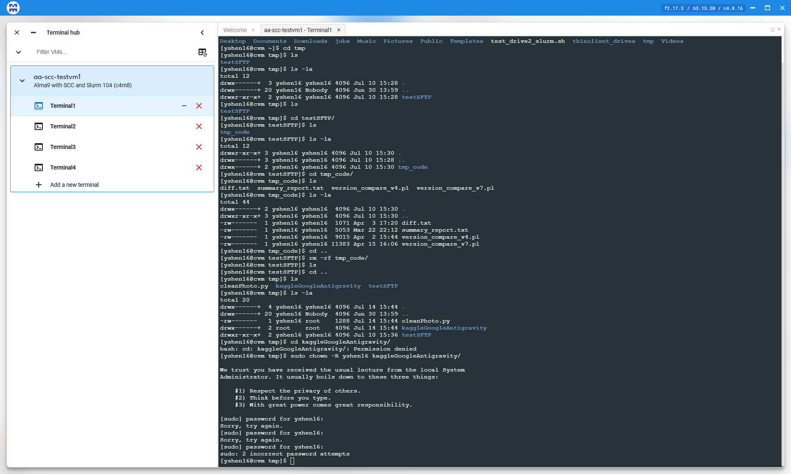

*Directory ownership after copying from Vault into a VM*

## Method Comparison

Now that you've seen each method in detail, here's a closer look at how they work, when to reach for each, and their trade-offs:

<table>
<colgroup>
<col style="width: 14%" />
<col style="width: 21%" />
<col style="width: 21%" />
<col style="width: 21%" />
<col style="width: 21%" />
</colgroup>
<tbody>
<tr class="odd">
<td><strong>Method</strong></td>
<td><strong>How It Works</strong></td>
<td><strong>When to Use</strong></td>
<td><strong>Advantages</strong></td>
<td><strong>Disadvantages</strong></td>
</tr>
<tr class="even">
<td><strong>SFTP to VM</strong></td>
<td>WinSCP connects directly to the VM over SFTP through the tiCrypt tunnel; you drag and drop files between two side-by-side panels.</td>
<td>One-time or occasional uploads; you just need to get a few files onto the VM without ongoing access.</td>
<td><ul>
<li><p>No install beyond WinSCP</p></li>
<li><p>Simple, visual, low setup</p></li>
<li><p>Credentials are ephemeral per session</p></li>
</ul></td>
<td><ul>
<li><p>Write-only — can't download/browse existing VM files</p></li>
<li><p>Manual reconnect needed each session</p></li>
<li><p>Not suited to large batch transfers</p></li>
</ul></td>
</tr>
<tr class="odd">
<td><strong>SSHFS</strong></td>
<td>SSHFS-Win + WinFsp mount the VM as a network drive letter in File Explorer, backed by the same SFTP tunnel.</td>
<td>Ongoing work sessions where you want to browse/edit VM files like a local folder over a period of time.</td>
<td><ul>
<li><p>Drag-and-drop from File Explorer</p></li>
<li><p>Feels like a local/network drive</p></li>
<li><p>No client app window to manage</p></li>
</ul></td>
<td><ul>
<li><p>One-time driver install (WinFsp + SSHFS-Win)</p></li>
<li><p>Mount breaks when the tiCrypt session/port expires</p></li>
<li><p>Occasional stale credential prompts</p></li>
</ul></td>
</tr>
<tr class="even">
<td><strong>lftp</strong></td>
<td>A command-line SFTP client running inside WSL connects to the same tunnel; transfers and scripting happen via typed commands.</td>
<td>Bulk, repeated, or scripted transfers; resumable or parallel uploads; comfortable working in a terminal.</td>
<td><ul>
<li><p>Resumable and parallel (--parallel=N) transfers</p></li>
<li><p>Scriptable/automatable</p></li>
<li><p>Handles large batches well with mirror</p></li>
</ul></td>
<td><ul>
<li><p>Requires WSL install (Windows-only limitation)</p></li>
<li><p>Needs one-time mirrored-networking + auto-confirm setup</p></li>
<li><p>No native GUI — command syntax to learn</p></li>
</ul></td>
</tr>
<tr class="odd">
<td><strong>SFTP Inbox / Vault</strong></td>
<td>You create an expiring inbox access point in your Vault; an external collaborator uploads through a shared link or SFTP client into your encrypted Vault.</td>
<td>Receiving files from people who don't have tiCrypt accounts — external partners, collaborators, vendors.</td>
<td><ul>
<li><p>No tiCrypt account needed for the sender</p></li>
<li><p>Expiration date limits exposure</p></li>
<li><p>Files land encrypted in your Vault</p></li>
</ul></td>
<td><ul>
<li><p>Extra step to move files from Vault into a VM</p></li>
<li><p>Requires admin-configured SFTP server first</p></li>
<li><p>Slight delay before uploads appear</p></li>
</ul></td>
</tr>
</tbody>
</table>

## Quick Reference

Choose the right method based on your use case:

|                |                                                                                                                                 |            |
|----------------|---------------------------------------------------------------------------------------------------------------------------------|------------|
| **Method**     | **Use Case**                                                                                                                    | **Tool**   |
| **SFTP to VM** | One-time or ad hoc file upload from your local machine into the VM.                                                             | WinSCP     |
| **SSHFS**      | Ongoing work. Mounts your VM as a drive in File Explorer for drag-and-drop.                                                     | SSHFS-Win  |
| **lftp**       | Bulk, scripted, or resumable transfers from the command line. Requires one-time WSL + mirrored-networking + auto-confirm setup. | WSL + lftp |
| **SFTP Inbox** | Receiving files from external collaborators with no tiCrypt access.                                                             | Vault      |

## Support

For tiCrypt SFTP setup or permissions issues at BU, contact:

- SCC Help: help@scc.bu.edu

- Research Computing: rcs@bu.edu

- VM Owner / Admin: Augustine Abaris — augustin@bu.edu

*Last updated: July 2026 | BU Research Computing Services*
