# tiCrypt Remote Desktop App Instructions for Windows

## Step-by-Step

#### Step 1: Start Remote Desktop

Click **Start Remote Desktop** from the right-side menu of your VM.

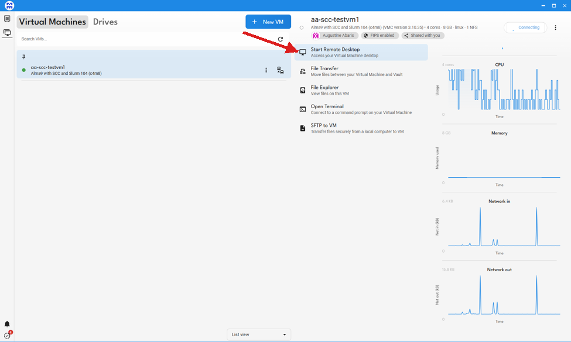

#### Step 2: Copy the RDP Password

In the "Instructions for aa-scc-testvm1" pop-up window, click the clipboard icon next to the **Password** field. This copies the RDP session password to your clipboard, ready to paste in the next step.

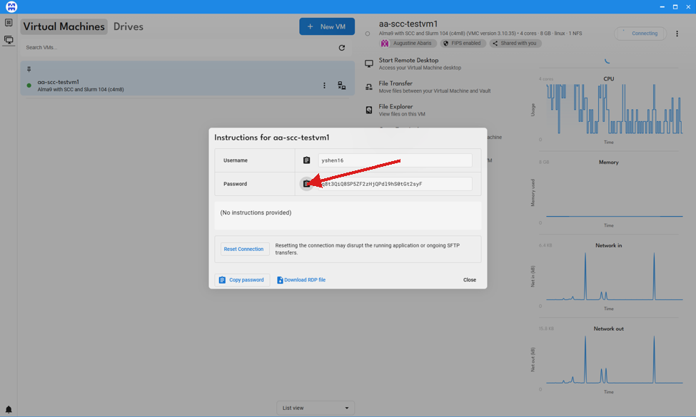

#### Step 3: Handle the Security Warning

A "Remote Desktop Connection security warning" pop-up will appear automatically alongside the Instructions window when you click **Start Remote Desktop**. If it was closed or did not appear, you can launch it manually by downloading the RDP file and double-clicking it (see the [Troubleshooting](#troubleshooting) section for details).

**Optional:** Check the **Clipboard** checkbox before clicking **Connect**. This allows you to copy and paste content between your local machine and the VM, which is highly recommended.

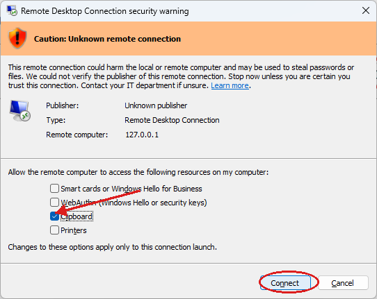

#### Step 4: Wait for the Connection

The Remote Desktop Connection progress window will appear:

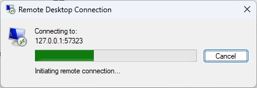

Once the connection is established, the following credential prompt will appear:

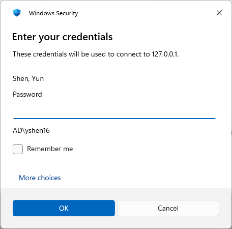

#### Step 5: Paste the Password

Paste the password copied in Step 2 into the **Password** field, then click **OK**.

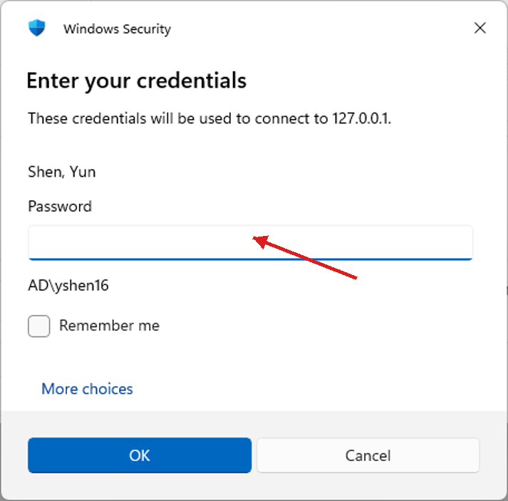

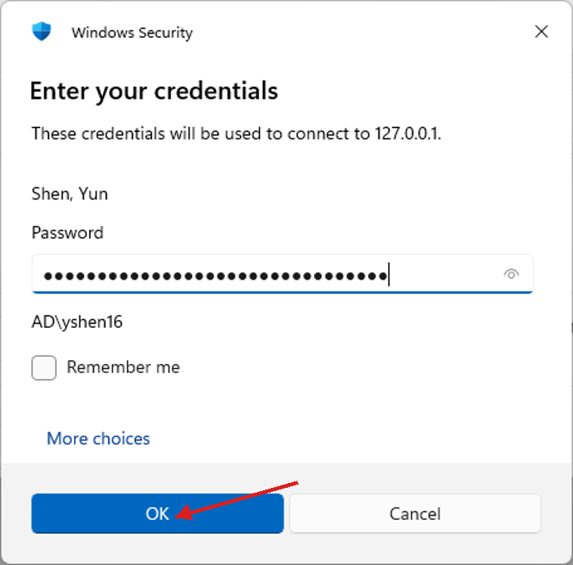

#### Step 6: Remote Desktop Opens

The Remote Desktop window will appear after a brief initialization:

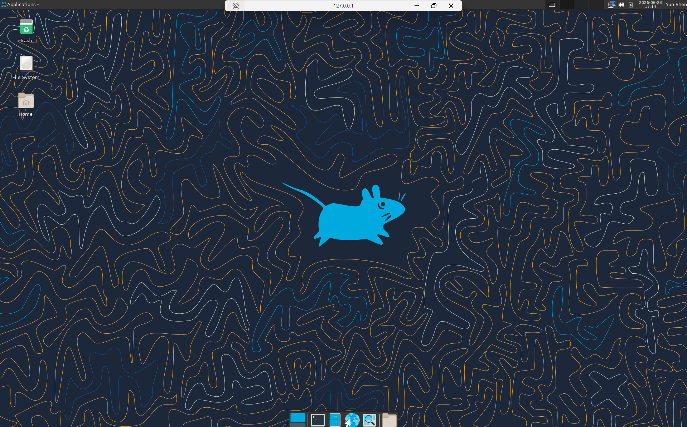

## Troubleshooting

Steps 1–6 above describe the normal flow. The following section covers common issues you may encounter.

### Issue: The RDP window did not appear or disappeared for some reason

**Solution:** In the Instructions dialog, click **Download RDP file** and save it to your computer. Double-click the downloaded file to launch the RDP connection manually, then continue from Step 3.

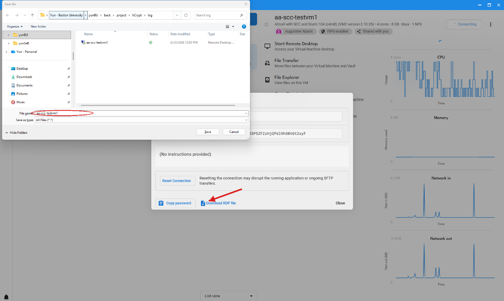

### Issue: Unable to connect — the Remote Desktop Connection progress window closes and displays an error

**Solution:** This is usually caused by an expired tunnel connection. First, try clicking **Reset Connection** in the Instructions dialog. If the problem persists, close the current session and restart the entire process from Step 1.

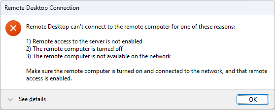

Click **See details** to read more details:

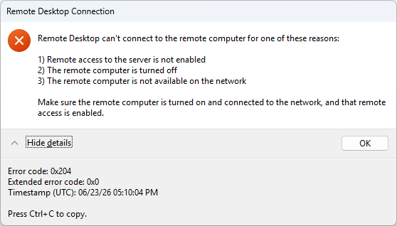

First try to reset the connection (it will prompt you that it will interrupt the work done on the existing connection, just click **OK**):

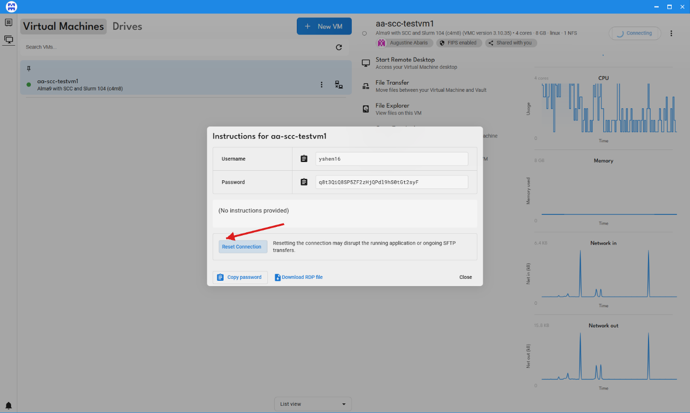
